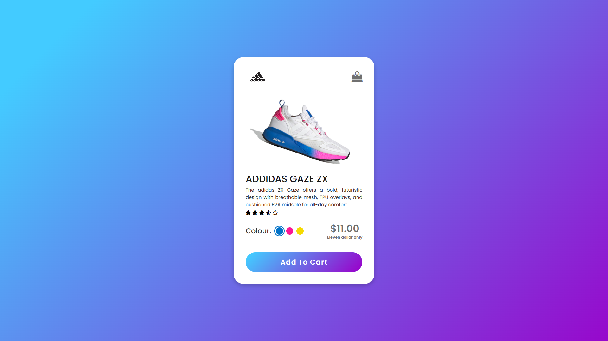

# Product Card

A stylish and interactive product card built with HTML, CSS, and JavaScript. It includes color selection, image switching, an add-to-cart ripple effect, and an improved modern UI.

## Features

- 🎨 **Color Selection**: Choose different colors for the product, and the corresponding image updates dynamically.
- 📷 **Image Switching**: Clicking a color option changes the displayed product image.
- 🛒 **Add to Cart Animation**: A smooth ripple effect when clicking the "Add to Cart" button.
- 🌟 **Responsive Design**: Looks great on all devices.
- 💡 **Modern UI**: Enhanced visuals with gradients, shadows, and smooth transitions.

## Demo


## Installation

1. Clone the repository:
   ```sh
   git clone https://github.com/your-username/product-card.git
   ```
2. Open the project folder:
   ```sh
   cd product-card
   ```
3. Open `index.html` in your browser.

## Technologies Used

- HTML5
- CSS3 (Flexbox, Animations, Gradients)
- JavaScript (DOM Manipulation, Event Listeners)

## How It Works

1. **Color Selection**: Clicking a color circle updates the active class and changes the product image.
2. **Add to Cart Animation**: When the button is clicked, a ripple effect appears and disappears after the animation ends.
3. **Responsive Layout**: Adjusts properly on different screen sizes.

## Issues & Troubleshooting

If you face issues:
- Ensure JavaScript is enabled in your browser.
- Check the console (`F12` > Console) for errors.
- Verify that all files (`CSS` and `JS`) are correctly linked in `index.html`.

## Contributing

Feel free to fork and improve this project. Pull requests are welcome!


